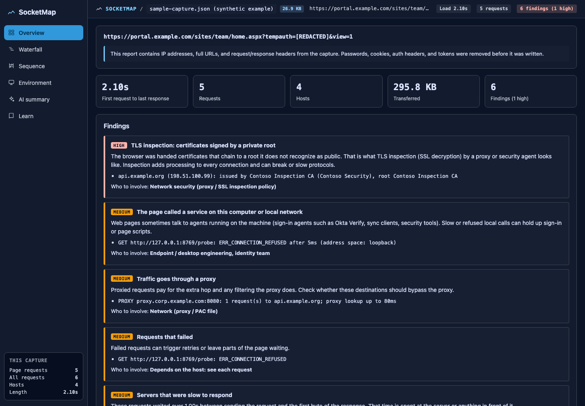
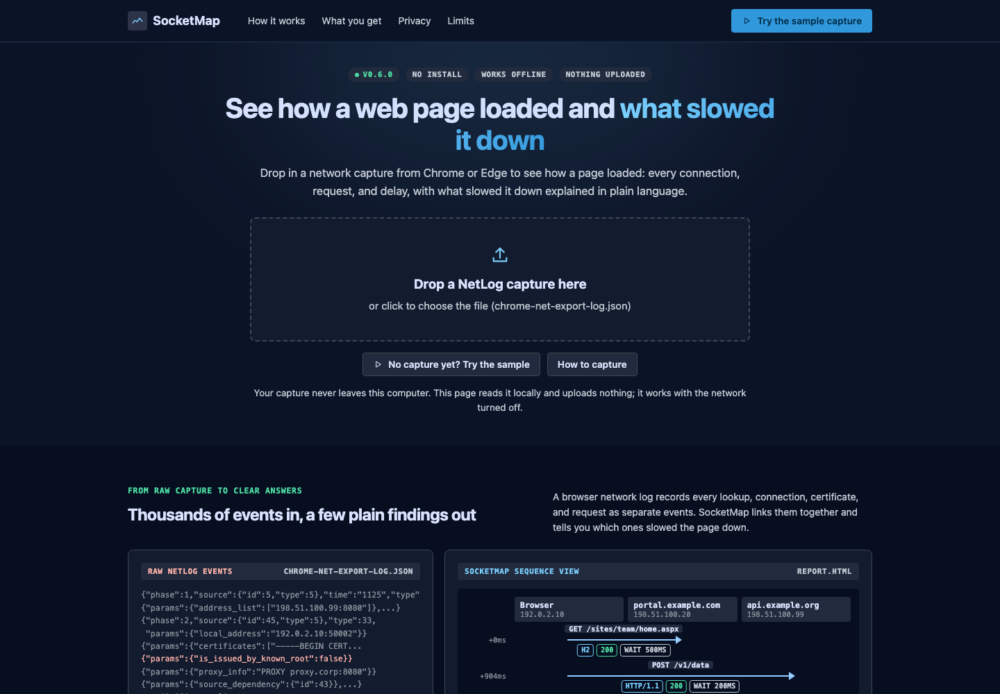
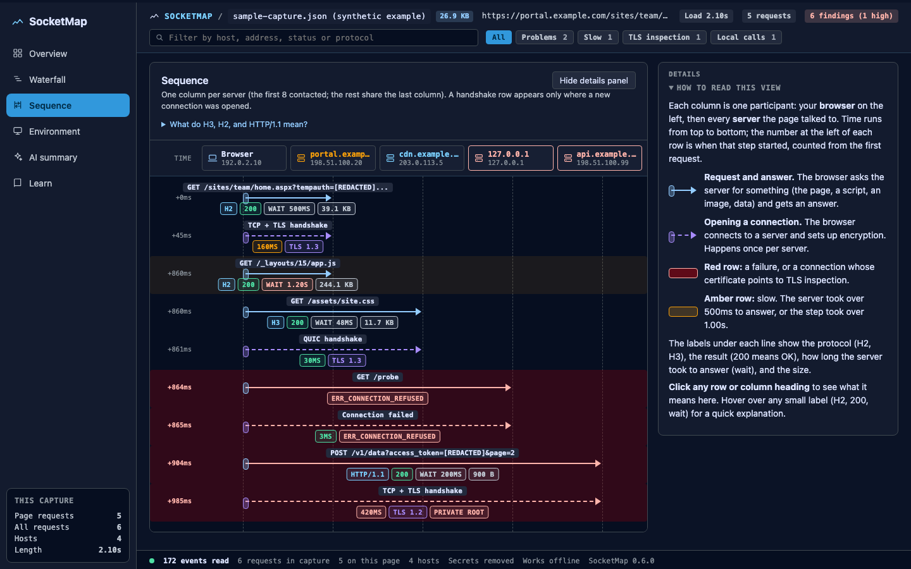

# SocketMap

**See how a web page loaded, and what slowed it down.**

SocketMap turns a browser network capture from Chrome or Edge (`chrome://net-export`) into a single, self-contained HTML report: every connection, DNS lookup, certificate, and request, linked together, rated, and explained in plain language. It flags the usual enterprise culprits (TLS inspection, proxies, calls to agents on the local machine, slow DNS, slow servers, blocked QUIC) with the evidence and the team to involve.

- **Nothing to install for most people.** Open `socketmap-viewer.html` in Chrome or Edge and drop in a capture.
- **Private.** Captures are read locally and never uploaded. Reports strip passwords, cookies, auth headers, and tokens.
- **Offline.** The viewer and every report load nothing from the internet.
- **Zero dependencies.** The command-line tool uses only Node.js built-ins.



---

## Contents

- [Quick start on Windows](#quick-start-on-windows)
- [Quick start on macOS](#quick-start-on-macos)
- [Capture a slow page](#capture-a-slow-page)
- [Read the report](#read-the-report)
- [Share safely](#share-safely)
- [Company branding](#company-branding)
- [What SocketMap cannot see](#what-socketmap-cannot-see)
- [Command reference](#command-reference)
- [For developers](#for-developers)

The [user guide](docs/USER-GUIDE.md) explains every part of the report in plain language.

---

## Quick start on Windows

### Option A: just open the viewer (no install)

If someone has already built `socketmap-viewer.html` for you, save it anywhere, double-click it (it opens in Edge or Chrome), and drop your capture on it. Click **Try the sample capture** to see a finished report first.



### Option B: get SocketMap and build the viewer yourself

1. Install Node.js (LTS) and Git, in PowerShell:
   ```powershell
   winget install OpenJS.NodeJS.LTS
   ```
   ```powershell
   winget install Git.Git
   ```
   Close and reopen PowerShell afterwards so the new commands are found. No admin rights? Download the Node.js LTS installer from [nodejs.org](https://nodejs.org) instead, or skip Git and use GitHub's **Code > Download ZIP** button, then unzip.
2. Get the code. The repository is private, so Git asks you to sign in to GitHub the first time:
   ```powershell
   git clone https://github.com/jeffrolson/SocketMap.git
   ```
   ```powershell
   cd SocketMap
   ```
3. Build the viewer and open it:
   ```powershell
   npm run build:viewer
   ```
   ```powershell
   start socketmap-viewer.html
   ```
4. Or build a report straight from a capture:
   ```powershell
   node bin\traceviz.mjs "$env:USERPROFILE\Downloads\chrome-net-export-log.json" -o report.html --open
   ```

There is no `npm install` step: SocketMap has no dependencies.

## Quick start on macOS

Install Node.js LTS from [nodejs.org](https://nodejs.org) (or `brew install node`), then:

```bash
git clone https://github.com/jeffrolson/SocketMap.git
```
```bash
cd SocketMap && npm run build:viewer && open socketmap-viewer.html
```

Or build a report straight from a capture:

```bash
node bin/traceviz.mjs ~/Downloads/chrome-net-export-log.json -o report.html --open
```

Want to see a report without capturing anything? `npm run demo` writes `demo-report.html` from the built-in synthetic capture.

---

## Capture a slow page

A NetLog records far more than DevTools does: the proxy decision, DNS, every connection, and the certificate each server presented. It works in any Chrome or Edge browser.

1. Close other tabs, so their traffic does not mix into the capture.
2. Open a new tab and go to `chrome://net-export` (in Edge: `edge://net-export`).
3. Leave **Strip private information** selected and click **Start Logging to Disk**. Save the file (the default name is `chrome-net-export-log.json`).
4. In another tab, load the slow page, or repeat the slow action.
5. Go back to the net-export tab and click **Stop Logging**.

Tip: capture the same page twice, for example on the office network and at home, or with and without the VPN. Comparing the two reports usually points straight at the cause.

## Read the report



The report has six tabs:

| Tab | What it shows |
|---|---|
| **Overview** | Load time, request and host counts, **Findings** (each with evidence and who to involve), where the time went, and every host rated Best / Better / Good / Poor |
| **Waterfall** | Every request in start order with its time split into phases. Click a row for timing, connection, certificate, and headers |
| **Sequence** | The page load as conversations between the browser and each server. Click any row or column heading for a plain-language explanation; hover any label (H2, 200, wait) for a definition |
| **Environment** | Browser, OS, local IP, DNS servers and search domains, secure DNS, and proxy setup at capture time |
| **AI summary** | A compact text version to paste into your AI assistant |
| **Learn** | Next steps, links to deeper tools (Web Vitals, DevTools, Microsoft 365 networking, Wireshark), and a glossary |

The filter at the top of the Waterfall and Sequence tabs narrows both to **Problems**, **Slow**, **TLS inspection**, or **Local calls**, or to anything matching a search.

Host ratings:

| Measure | Best | Better | Good | Poor |
|---|---|---|---|---|
| Protocol | HTTP/3 (QUIC) | HTTP/2 | HTTP/1.1 | QUIC failed, fell back to TCP |
| TLS | 1.3 | 1.2 | | Below 1.2 |
| Connection setup | Reused an open connection | New, under 100 ms | 100 to 300 ms | Over 300 ms, or failed |
| DNS | From cache | Under 20 ms | 20 to 100 ms | Over 100 ms, or failed |
| Path | Direct | Through a proxy | | Certificate from a private root (TLS inspection) |
| Server wait (median) | Under 200 ms | 200 to 500 ms | 500 ms to 1 s | Over 1 s |

## Share safely

- Reports **remove** passwords, cookies, authorization headers, and tokens, including tokens inside URLs.
- Reports **keep** IP addresses, host names, full URLs, and certificate details, because the network team needs them. Share reports the way you would share any internal troubleshooting data.
- Raw captures never need to be shared: send the report instead. Keep captures out of Git (this repository already ignores `captures/`, `examples/*.json`, and `*.netlog`).

## Company branding

Reports and the viewer take their colors, fonts, and rounding from [`DESIGN.md`](DESIGN.md). To brand them:

1. Copy `DESIGN.md` to `themes/<company>/DESIGN.md` and change the tokens at the top.
2. Build with it:
   ```bash
   node bin/traceviz.mjs capture.json -o report.html --theme themes/<company>/DESIGN.md
   ```
   ```bash
   npm run build:viewer -- socketmap-viewer.html --theme themes/<company>/DESIGN.md
   ```

Fonts are used only if installed on the viewer's machine; nothing is downloaded.

## What SocketMap cannot see

A NetLog records network activity only. It cannot show time spent running the page's own code (use a Chrome DevTools Performance profile), security software acting inside the browser, packet-level problems such as retransmissions (use Wireshark), or what servers do internally. The report says so rather than guessing.

---

## Command reference

```text
node bin/traceviz.mjs <capture> [options]

  -o, --output <file>    Output HTML file (default: ./trace-diagram.html)
  --page <site>          NetLog: analyze this site (for example https://contoso.sharepoint.com)
  --theme <DESIGN.md>    NetLog: style the report with another design.md theme
  --filter <regex>       Only include requests whose URL or method matches
  --open                 Open the result in your default browser
  --sample               HAR/JSON diagram demo (see docs/HAR-DIAGRAM.md)
  -h, --help             Show help
  -v, --version          Show version
```

| npm script | What it does |
|---|---|
| `npm run build:viewer` | Builds `socketmap-viewer.html` (add `-- <file> --theme <DESIGN.md>` to customize) |
| `npm run demo` | Builds `demo-report.html` from the synthetic sample capture |
| `npm run verify` | Runs every test and repository check |
| `npm run generate:theme` | Recompiles the theme after editing `DESIGN.md` |

HAR files and generic JSON traces produce an older diagram view instead of the report; see [docs/HAR-DIAGRAM.md](docs/HAR-DIAGRAM.md).

## For developers

- **Verify:** `npm run verify` runs the tests, the theme freshness check, and the context-file checks. It works the same on Windows, macOS, and Linux with Node.js 18 or later.
- **How it works:** [`ARCHITECTURE.md`](ARCHITECTURE.md). **Rules for contributors and AI agents:** [`AGENTS.md`](AGENTS.md). **Requirements:** [`SPEC.md`](SPEC.md). **Plan:** [`ROADMAP.md`](ROADMAP.md). **History:** [`CHANGELOG.md`](CHANGELOG.md). **Testing:** [`TESTING.md`](TESTING.md). **Contributing:** [`CONTRIBUTING.md`](CONTRIBUTING.md).
- Test data is synthetic and uses documentation IP ranges only. Never commit a real capture.

## License

MIT, as declared in `package.json`.
